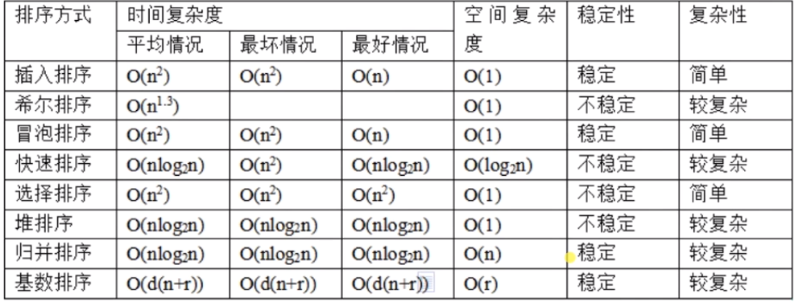

## js 数据结构与算法

### 简单算法
- 字符串
- 数组
   - 知识点
     - Array.prototype.splice
- 正则
- 排序
- 递归

### 基础算法之“字符串类”
字符串作为JS最基本的数据类型，掌握好字符串类型的算法题目是学习算法最好的入门阶梯，也是业务开发中最受用的部分之一。
#### 反转字符串中的单词
- 知识点
    - String.prototype.split
    - String.prototype.match
    - Array.prototype.map
    - Array.prototype.reverse
    - Array.prototype.join

#### 计数二进制子串
题目：给定一个字符串 s ，计算具有相同数量 0 和 1 的非空（连续）子字符串的数量，并且这些子字符串中的所有 0 和所有 1 都是组合在一起的。重复出现的子串要计算它们出现的次数。  
示例1：  
**输入**： “00110011”  
**输出**： 6  
**解释**：有 6 个子串具有相同数量的连续 1 和 0：“0011”，“01”，“1100”，“10”，“0011”，“01”。
请注意，一些重复出现的子串要计算它们出现的次数。  
另外，“00110011”不是有效的子串，因为所有的 0 （和 1）没有组合在一起。  

- 难度大的算法题如何解？
  - 算法的本质是寻找规律并实现
- 如何找到规律？
  - 发现输入和输出的关系，寻找突破点
- 复杂的实现怎么办？
  - 实现是程序 + 数据结构的结合体

**0011**0011  
0**011**0011  
00**1100**11  
001**10**011  
0011**0011**  
00110**01**1  

### 基础算法之“数组类
数组是JS世界里必不可少的类型，“小小”的数组，“大大”的世界，一维、二维空间、组合、分组、堆栈、队列等等都离不开它，学习这个章节打开潘朵拉的盒子吧。
#### 电话号码的组合（公式运算）

#### 卡牌分组（归类运算）
leetcode 914.卡牌分组  
操作系统支持的最大数`Number.MAX_SAFE_INTEGER`,
对数组的清空使用`arr.length = 0`,复制数组`[].concat(arr)`
#### 种花问题（筛选运算）
leetcode 605  
数学建模是算法中最有用的理论课
知识点：问题抽象、数学建模、动态输入
#### 格雷编码（二进制运算）
leetcode 89  
知识点：发现规律、动态输入。  

### 基础算法之“正则类”
正则是让人又爱又恨的JS知识，“爱”它的神通广大，“恨”它的抽象难懂，我们尝试从基础用法到高级模式匹配让你走近它的梦幻世界
#### 重复的子字符串
459.重复的子字符串  
知识点：重视基础、知识全面
#### 正则表达式匹配
总结规律、分布演练

### 基础算法之“排序类”
排序是学生时代标志性的回忆，然而如何魔改“冒泡排序”、“选择排序”让很多看似与排序无关的题目迎刃而解是不是闻所未闻，还等什么呢？
时间复杂度：看的是运行次数。
空间复杂度：看的是占内存情况。

#### 冒泡排序、选择排序
重点是理解原理

#### 最大间距
164.最大间距  
一般思路：先调用 sort api 排序，然后两两相减取最大值。   
这样性能不是最优，因为排序之后又循环了一遍，可以在使用冒泡排序过程中把最大值比较完成。

#### 数组中第 K 个最大元素
215  
要吃透基础的排序算法，因为它是所有变种排序的基石。

#### 按奇偶排序数组Ⅱ
922  
一半是奇数一半是偶数，数组的长度一定是偶数。

#### 缺失的第一个正数
41  
0 不是正整数。
运用选择排序做最优解。

### 递归

#### 复原 IP 地址
255 在 ip 中是最大的情况。  
ip 由 三个 . 分成四份，每一份都是 0 ~ 255。

#### 串联所有单词的子串
30  
缺（6 - 2 ~ 6 - 4）

## 数据结构
- 栈
- 队列
- 链表
- 矩阵
- 二叉树
- 堆

### 栈
#### 682.棒球比赛

#### 85.最大矩形

### 队列
#### 622.设计循环队列
#### 621.任务调度器
es6 api `string.padEnd(5, '-')`长度不够符号来凑。

### 链表
#### 148.排序链表

#### 141.环形链表
缺（9-4）

### 矩阵
#### 54.螺旋矩阵

#### 48.旋转图像
按中间行对换元素，然后再按对角线交换元素。

### 二叉树
#### 101.对称二叉树
二叉树的特性：一个节点有两个子节点（左节点、右节点）  
重点：  
- 计算当前节点属于哪一层
- 记录当前层的起始点
- 记录上一层的起始点
- 找到当前节点的父节点

#### 98.验证二叉搜索树

### 堆
基本概念：
- 必须是完全二叉树（满二叉树：不存在空余节点；完全二叉树：n-1 层必须是满二叉树。）
- 任一节点的值是其子树所有节点的最大值或最小值（最大堆、最小堆）

排序：
构建最大堆的过程会选出一个最大值。

#### 451.根据字符出现频率排序
1. 统计
2. 排序
3. 输出

string.repeat(number) 构造并返回一个新字符串，该字符串包含被连接在一起的指定数量的字符串的副本。

#### 313.超级丑数
- 丑数： 只包含因子 2、3、5 的正整数被称作丑数，比如 4、10、12 都是丑数，而 7、23、111 则不是丑数，另外 1 也是丑数
- 超级丑数
- 质因数：质因数就是一个数的约数，并且是质数
- 质数：在大于 1 的自然数中，除了 1 和 它本身意外不再有其它因数

解题思路：
1. 求解任意整数的质因数
2. 质因数是否在指定质因数范围内
3. 是否达到指定个数 n

堆在排序上有一定的应用，而在查找上也有一定的优势。

### 进阶算法
- 思想
  - 贪心算法
    - 买卖股票的最佳时机Ⅱ
    - 柠檬水找零
  - 动态规划
- 经验

#### 122.买卖股票的最佳时机Ⅱ
问题：最大利润
- 策略1：从最低点买入，在最高点卖出（追求单次利益）
- 策略2：从低点买入，只要可以赚钱就卖出，不断买卖（追求多次利益）
- 策略2：从低点买入，到价格高点卖出，不断买卖（在保证单词利益的基础上，实现多次交易）

具体代码见`code/greed/lesson1.js`

#### 860.柠檬水找零
问题：找零钱  
- 策略1：给钱找零，不区分金额直到找到足够的零钱（追求单次找零）
- 策略2：给钱找零，优先给金额大的零钱，尽量把零钱放在手里（追求多次找零）
具体代码见`code/greed/lesson2.js`

### 动态规划
包括三个重要概念：状态转移方程、最优子结构、边界

#### 63.不同路径Ⅱ
不同路径问题优先考虑动态规划思想，
具体代码见`code/dp/lesson1.js`

#### 787.K 站中转内最便宜的航班
具体代码见`code/dp/lesson2.js`

## 总结
- 基础算法
  - 常见类型：字符串、数组、正则
  - 常见题型：查重、排序、递归
  - 知识点：基础 API、常用技巧
- 数据结构与算法
  - 常见结构：栈、队列、链表、矩阵、二叉树、堆
  - 常见题型：结构实现、查找、排序、拓展应用
  - 知识点：原理、实现、实战思想（学会改数据结构）
- 进阶算法
  - 思想
    - 贪心算法
    - 动态规划

## 前端人的危机如何破解
不失信于人是破除危机的根本前提。  

### 人生感悟
选择和被选择都是一种能力。  
可以选择是一种资本，可以被选是一种资历，无论是哪种都可以成就一番事业，不然危机会大一些，遗憾也会随之而来，破除危机无非就是积攒可以选择的资本亦或是增加被选择的资历。  

### 入门级
- 如何学习
  - 途径：网络博客（内容偏零散，质量不保证）、视频教程、培训班（不推荐，盈利性目标明显）
  - 方法：临摹
  - 自测：是不是能力独立解决问题
  - 心态：脚踏实地、切莫投机取巧
  - 独立思考、学习的技巧
- 如何面试（怎么找到工作；怎么在当前的基础上找到更好的工作）
  - 认为面试没有技巧的：只能说还太年轻，在社会上的阅历在职场的经验比较薄弱，只看到了自己看到的那一面，很多面就没考虑到也没看到，他也意识不到，或者说他也排斥去认识这种更大的视野。
  - 不赞同「没有能力就没有格局」：刘备不是能力最大
  - 不能太专注于自己的视野做事情
  - 目标：工作机会
  - 准备：基础知识（全面系统） + 实战经验，每个人都允许有知识盲区
  - 技巧：基础 + 能力（用什么样的知识点解决了什么样的问题） + 潜力（公司对你的期望值企业所要关心的问题）
  - 自测：刷题 + 面经（别人的面经也可以当作你的阅历） + 技术分析
- 如何提升
  - 目标：提升解决问题的能力
  - 方法：多看、多听、多做、多思考，不放过任何一个机会
  - 忌讳：自负、多问、懒散
  - 自测：是否能独立解决问题

### 中高級
- 如何學習
  - 背景：学的很累
  - 原则：先少后多、先精后广
  - 方法：平衡学习、工作、生活的时间；利用社区的力量
- 如何成長
  - 定义：技术、做事
  - 方法：自驱动、敢于挑战、承担责任
  - 自测：技术架构、独立做事、彼此成就
- 如何晋级
  - 目标：加薪、晋级
  - 方法：少说、多做、任劳任怨、有效沟通、拒绝平庸、全面发展
  - 心态：先付出再回报、个人服从集体、学会定位和补位、足够耐心